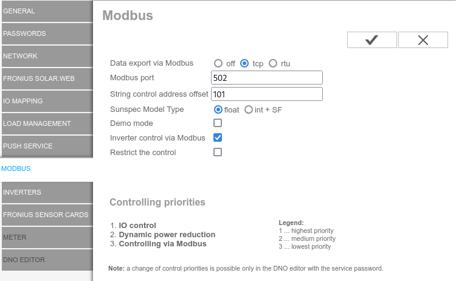
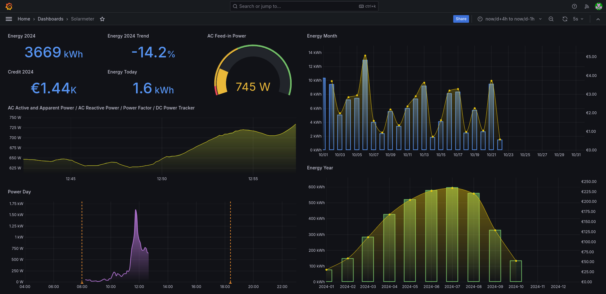

# Froniusd

Although Fronius provides a nice web application in the cloud and a mobile application which shows graphs and a history of the produced energy, I still would like to fully own my data and be able to store the data without dependence on a third party service. Hence the motivation to utilize the Modbus data export function of my Fronius inverter to store the data locally in TimescaleDB and Grafana for visualisation.

The Froniud daemon connects to the inverter either with Modbus TCP (network) or Modbus RTU (serial cable) and forwards the data as a formatted JSON string to a MQTT broker. My personal software stack consists of the Mosquitto MQTT broker, which in turn is connected to PostgreSQL with TimescaleDB extension via a NodeRED flow. The complete setup is described in detail at the [Smartmeter](https://github.com/ahpohl/smartmeter/wiki) wiki, but all the necessay files are provided here in the resources section.

## Build instructions

Froniusd depends on [libsunspec](https://github.com/ahpohl/libsunspec), a library which provides the necessary low level methods to access the inverter and on [libmosquitto](https://mosquitto.org/) for connecting to the MQTT broker. Packages of [froniusd](https://aur.archlinux.org/packages/froniusd) and [libsunspec](https://aur.archlinux.org/packages/libsunspec) are published in the AUR. If you need to compile Froniusd directly from source, a Makefile for (cross-)compilation is provided.

```
make CROSS_COMPILE=aarch64-unknown-linux-gnu
make install
```

Instructions how to setup a cross toolchain and how to compile and install libmosquitto into the toolchain can be found [here](resources/mosquitto/README.md).

## Configuration

The Modbus data export needs to be enabled in the web interface. Here you have to choose between tcp and rtu mode. In case of rtu, a serial RS485-to-USB converter is required to connect the inverter to the host running Froniusd.



Froniusd is configured through a config file. Here you need to set the IP address of the inverter or the serial device, the broker and the topic, and the payment for each produced kWh at a minimum. A fully commented example is provided in the resources section. 

```
modbus_tcp primo.home.arpa
# modbus_rtu /dev/ttyUSB0
mqtt_topic solarmeter
mqtt_broker localhost
payment_kwh 0.3914
```

The daemon can be started with:

```
froniusd --config froniusd_example.conf

```

## Json output

Example JSON string published by Froniusd in the `solarmeter/live` topic:

```
{ "time":1729597414501,    # timestamp, sec since epoch
  "ac_energy":6813.517,    # AC total energy counter, kWh
  "ac_current":3.330,      # AC current, A
  "ac_voltage":234.400,    # AC voltage, V
  "ac_power_w":781.000,    # AC active power, W
  "ac_power_va":781.016,   # AC apparent power, VA
  "ac_power_var":-7.000,   # AC reactive power, VAr
  "ac_pf":99.996,          # AC power factor
  "ac_freq":50.010,        # AC frequency, Hz
  "ac_eff":94.565,         # AC conversion efficiency
  "dc_voltage_1":292.900,  # DC voltage string 1, V
  "dc_current_1":1.360,    # DC current string 1, A
  "dc_power_1":399.300,    # DC power string 1, W
  "dc_energy_1":3349.270,  # DC total energy string 1, kWh 
  "dc_voltage_2":294.200,  # DC voltage string 2, V
  "dc_current_2":1.440,    # DC current string 2, A
  "dc_power_2":426.590,    # DC power string 2, W
  "dc_energy_2":3398.550,  # DC total energy string 2, kWh 
  "payment":0.3914         # payment per kWh, € (or whatever)
 }

```

## Docker

There is a docker-compose for Froniusd provided, which lets you run Froniusd inside docker. For Modbus RTU, the serial device needs to be set in froniusd.conf and in the docker-compose.yaml. For Modbus TCP, the inverter host name/address is only taken from froniusd.conf.

```
docker-compose up --build
```

## Visualization

Grafana is used show the current and historic energy production on a dashborad, which is provided in the resource section. The energy trend calculation requires a model of the yearly energy production specific to the actual photovoltaic system. The model folder in the resource section contains a spreadsheet with raw data, a gnuplot fit and the final sql file with my current model.


